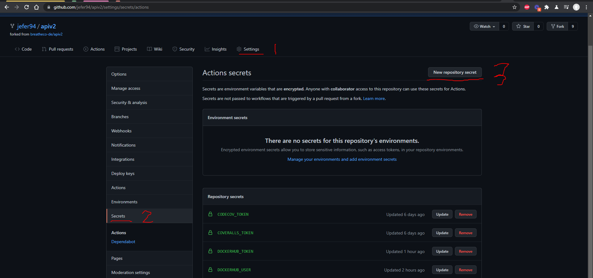

# Setup & Installation

1. Install redis, postgress, python 3.8+ and node 14+
2. Create environment variables `cp .env.example .env` (make sure to fill the variables with relevant values)
3. Make sure to get inside the environment: `pipenv shell`
4. Install the dependencies including development packages: `pipenv install --dev`
5. Run the migrations into your database `pipenv run migrate`
6. Run the fixtures to add sample data: `pipenv run python manage.py loaddata breathecode/*/fixtures/dev_*.json`
7. Make sure you can login into the django admin, you can create a login user with `python manage.py createsuperuser`
8. Enable pre-commit library: `pipenv run pre-commit install` (this library helps prevent longer error wait times and get instant feedbackpipe)

# Enable formatter in Visual Studio Code

- Open `.vscode\settings.json`
- Add

```python
  ...
  "editor.formatOnSave": true,
  "python.formatting.provider": "yapf"
```

- Save

# Setup & Installation with Docker

1. Generate the Breathecode Docker image `pipenv run docker_build`
2. Create environment variables `cp .env.example .env` (make sure to fill the variables with relevant values)
3. Run containers with `docker-compose up -d`
4. Make sure you can login into the django admin, you can create a login user with `docker-compose exec breathecode python manage.py createsuperuser`

# Documentation for BreatheCode API

[Read the docs](https://documenter.getpostman.com/view/2432393/T1LPC6ef)

# Additional Resources

## Online editor

[Gitpod](https://gitpod.io/#https://github.com/breatheco-de/apiv2)

## Run the tests

```bash
pipenv run test ./breathecode/
```

## Run coverage

Report with HTML

```bash
pipenv run coverage breathecode
```

## Fixtures

Fixtures are fake data ideal for development.

Saving new fixtures

```bash
python manage.py dumpdata auth > ./breathecode/authenticate/fixtures/users.json
```

Loading all fixtures

```bash
pipenv run python manage.py loaddata breathecode/*/fixtures/dev_*.json
```

## Icons

The following icons arebeing used for the slack integrations: <https://www.pngrepo.com/collection/soft-colored-ui-icons/1>

# troubleshooting

- `` Executable `yapf\` not found ``: this appear because the pre-commit use the python that found in the $PATH, this project has `yapf` installed in a virtual environment

```bash
# You should run the commands in the virtual environment
pipenv shell
git add .
git commit -m "message"

# You should install globally yapf if you want to commit using vscode
pip install yapf
```

## Configuring the required tokens

1. Get Dockerhub token
   
2. Add the repo to Coveralls https://coveralls.io/repos/new
3. Add the repo to Codecov https://app.codecov.io/gh/+
4. Set up the secrets
   
